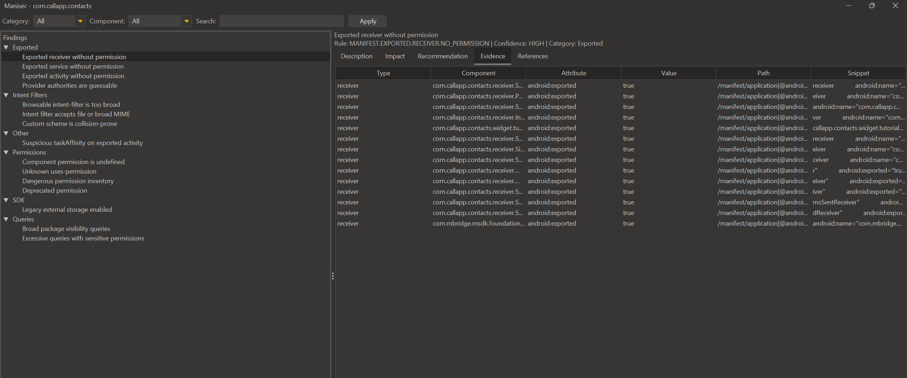

# Manisec

Jadx plugin that scans `AndroidManifest.xml` for security-relevant signals 

## Showcase


## Build
```
mvn -DskipTests package
```
Jar output:
```
target/manisec-<version>.jar
```

## Install (Jadx GUI)
- **Plugins → Install plugin** and pick the jar.
- Or install **Manisec** directly from the Jadx plugin store.

## Usage
- **Plugins → Manisec Report**